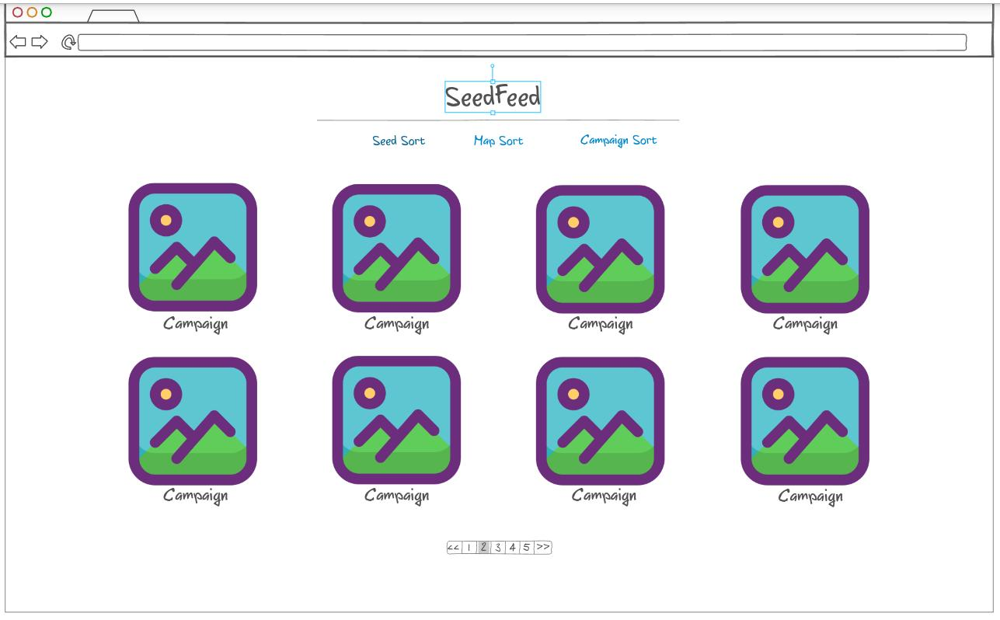
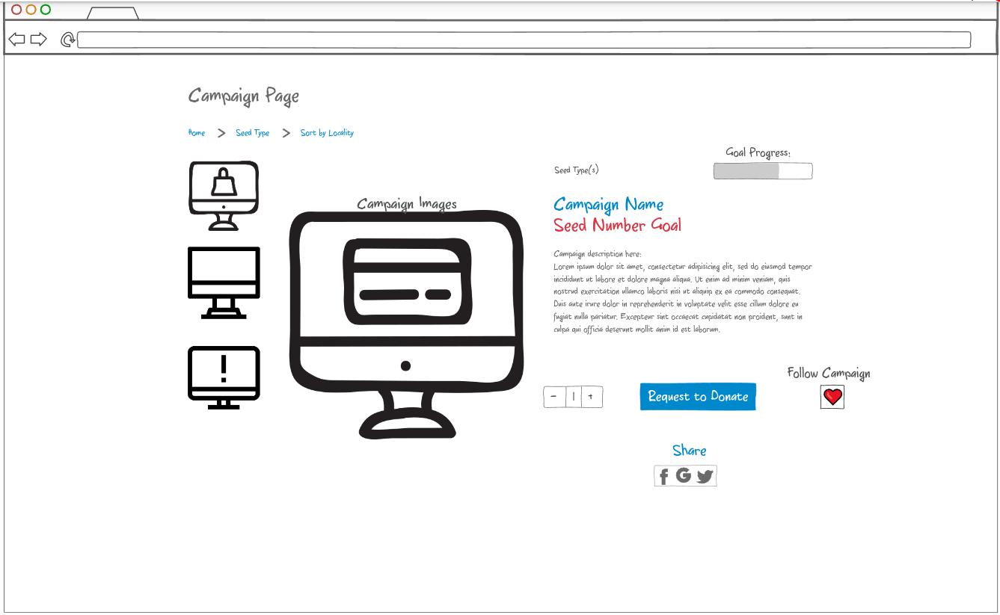

# Startup - RootRevolution
### "Growing Change from the Ground Up" (Literally)
## Elevator Pitch
RootRevolution put simply is a seed crowdfunder- the farmer friendly fundraising website that the world has been waiting for. Inspired by my family members who always have leftover seeds and don't know what to do with them, RootRevolution is a crowdfunding-based website where users with a surplus of seeds can donate their unsused seeds towards any cause, whether it be a community-focused or a global movement. That way, you can participate and be a part of something bigger without having to donate costly supplies or spend lots of money. RootRevolution connects you with anyone who has a need for seed, from solo-sowers and school gardens to larger community and global humanitarian organizations so that they can get the supplies they need to make a difference in any way from simply teaching valuable agricultural lessons or fighting hunger by providing food for those who need it most.
https://startup.rootrevolution.store

## Design
Each user has their own SeedFeed that shows them campaigns that they could support

Each campaign also gets its own page:

## Key Features
- Users have their own accounts to track their seed donations
- Donations can be tracked so users can grow their Seed Count
- Users can join a specific movement or organization to become more involved
- Connects users locally to make seed handling more convenient
- Users can request and start their own project and campaign
- Larger organizations can designate people on a local level to collect and receive seeds
- A map that users can opt into to see those around them who donated or need seeds

## Technologies
- HTML - uses HTML pages: one for login, one for a homescreen, one for each campaign, amd one for each user, and one for a seed map
- CSS - uses CSS to style the website for desktop and mobile users
- JavaScript - handles login, searching for campaigns, starting a campaign, and editing ones profile
- Service - Backend service with endpoints for:
  - login
  - retrieving campaigns
  - creating a campaign
  - requesting to donate seeds
  - retrieving seed map
- DB/Login - Store users, campaigns, and seed counts. Register and login users, and credentials securely stored in a database. Can request to donate without authentication, but email is required and seed count will not grow
- WebSocket - As campaigns are created, they are shown on the homescreens or the "SeedFeeds" of other users
  
## HTML Deliverable
For this deliverable I built the structure of my application using HTML
- HTML pages: one for login, one for a homescreen, one for each campaign, amd one for each user, and one for a seed map
- Links: there is a working nav menu with links to each page and links from the homescreen to each campaign
- Forms: there is a login form and a form to create a campaign
- Images: there are images on the homescreen of campaigns
- Tables: there is a table on the page of campaigns
- DB/Login - Input box and submit button for login. The user info and campaign info represent data pulled from the database.
- WebSocket - The WebSocket is used to update the homescreen with new campaigns

## CSS Deliverable

- [x] - Prerequisite: Simon CSS deployed to your production environment
- [x] - Prerequisite: A link to your GitHub startup repository prominently displayed on your application's home page
- [x] - Prerequisite: Notes in your startup Git repository README.md file
- [x] - 30% Header, footer, and main content body. Used flex to layout sections.
- [x] - 20% Navigation elements. Links highlight on hover.
- [x] - 10% Responsive to window resizing. Looks great on iPad, desktop, and iPhone.
- [x] - 20% Application elements. Buttons have nice styling and the homescreen is tiled
- [x] - 10% Application text content. Text is colored and themed after my deliverable
- [x] - 10% Application images. I made sure images were resizable and wouldn't ever be too large.
